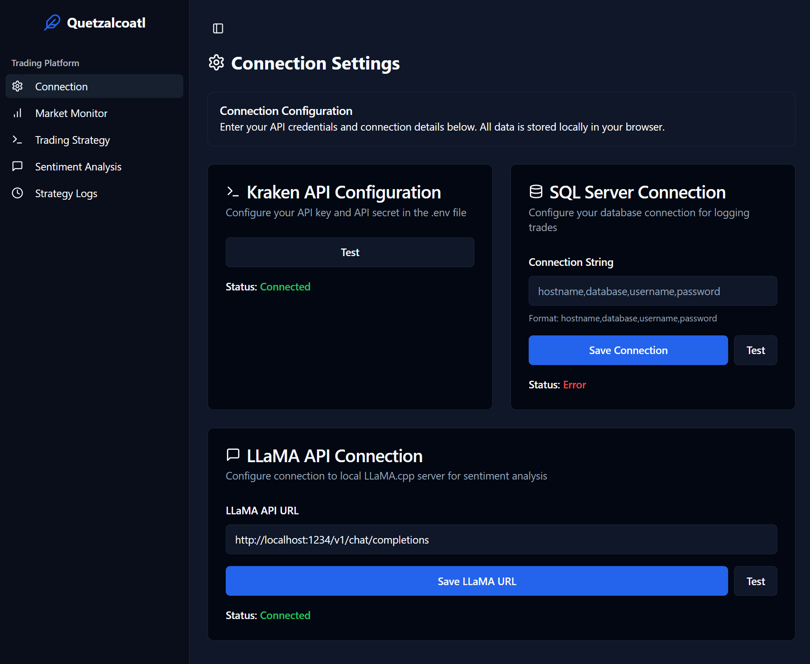

# 🐍 Quetzalcoatl

**Quetzalcoatl** is a Locally hosted web app UI for real-time LFT (Low-Frequency Trading) order flow and sentiment analysis trading interface project.

Here is live data being fed through a websocket feed for real time order data flow.


Built using **React**, **Vite**, and **TypeScript**, this application serves as both a live trading dashboard and strategy testing ground.

---

## 🔧 Prerequisites

To run this project locally, you will need:

- **Node.js (>= 18.x)** and **npm**
- **Kraken API Key and Secret**
  - Create or manage your API key at [https://www.kraken.com/u/security/api](https://www.kraken.com/u/security/api)
- **A locally hosted LLM server** for sentiment analysis
  - Expected to be available at `http://localhost:5000`
  - Accepts POST requests with market commentary or parsed trade sentiment input
- **Basic understanding of your portfolio's risk profile and trading strategy**

---

## 📦 Tech Stack

- **Frontend**: React + Vite + TypeScript
- **Data**: Kraken REST/WebSocket APIs
- **NLP Analysis**: Local LLM service (port 5000)
- **Icons/UI**: [Lucide React](https://lucide.dev/), Tailwind CSS (optional)

---

## 🚀 Getting Started

Clone the repo and install dependencies:

```bash
git clone https://github.com/your-username/quetzalcoatl-trading-ui.git
cd quetzalcoatl-trading-ui
npm install
```

Start the development server:

```bash
node start.cjs
```
Make sure your local LLM server is running on port 5000, and that your .env file includes your Kraken API credentials.

After connecting you will be able to connect your local llm server with a model of your choosing and perform sentiment analysis in a automated way privately and for free.


## 📄 Environment Variables

Create a .env.local file in the root directory and add the following:

```bash
VITE_KRAKEN_API_KEY=your_kraken_api_key
VITE_KRAKEN_API_SECRET=your_kraken_api_secret
```

After setting up you kraken api key and secret make sure to test the connection with a get request of the time.



